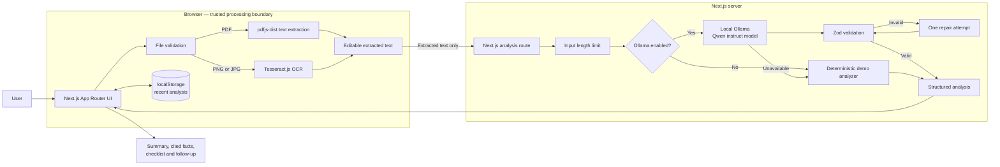
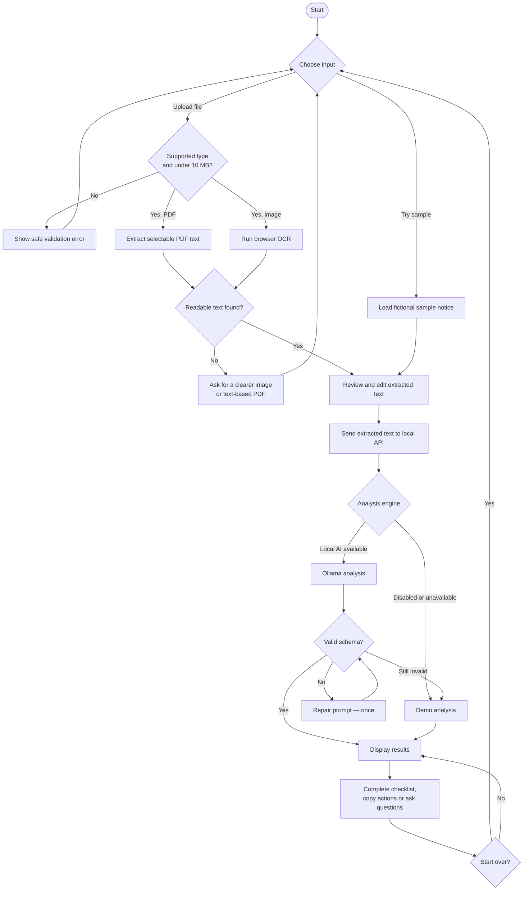
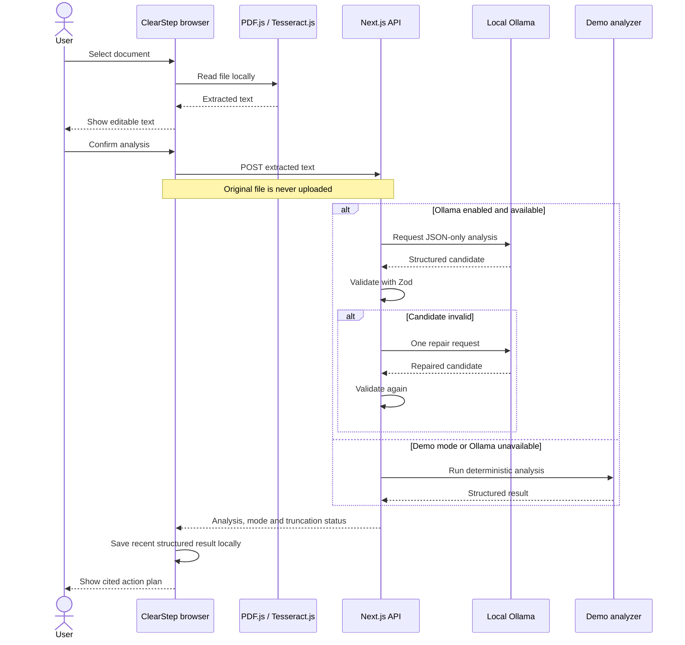
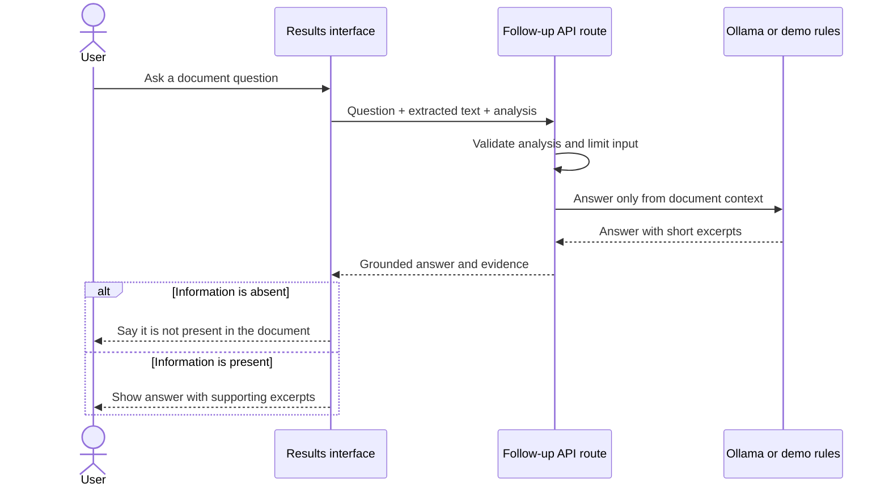
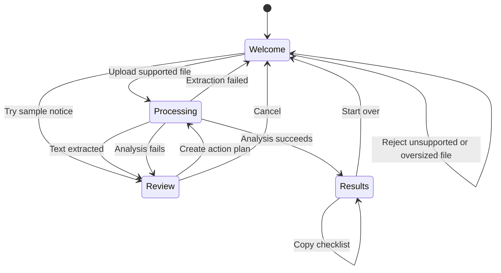
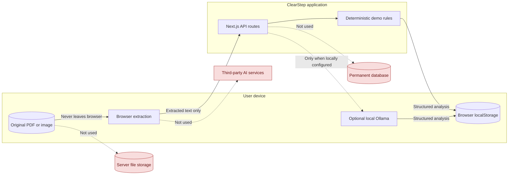
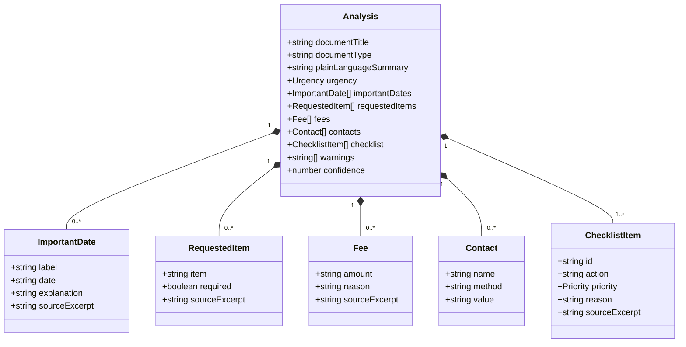
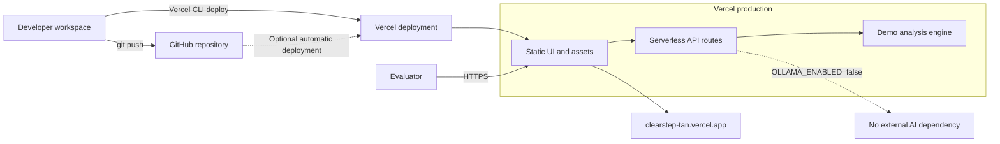

# ClearStep Mermaid Diagrams

These diagrams document the MVP architecture, user journey, processing behavior, privacy boundaries, and deployment model. GitHub renders Mermaid blocks directly.

## 1. System architecture



## 2. Document processing flow



## 3. Analysis request sequence



## 4. Follow-up question sequence



## 5. User-interface state machine



## 6. Privacy and data boundaries



## 7. Structured analysis model



## 8. Deployment topology



## 9. MVP component map

```mermaid
flowchart TD
    PAGE[app/page.tsx] --> UPLOAD[UploadPanel]
    PAGE --> RESULTS[Results]
    PAGE --> EXTRACT[lib/extract.ts]
    PAGE --> FILES[lib/files.ts]
    PAGE --> SAMPLE[lib/sample.ts]

    RESULTS --> FOLLOWUP[/api/follow-up]
    PAGE --> ANALYZE[/api/analyze]

    ANALYZE --> FALLBACK[lib/fallback.ts]
    ANALYZE --> OLLAMA[lib/ollama.ts]
    ANALYZE --> SCHEMA[lib/schema.ts]
    FOLLOWUP --> FALLBACK
    FOLLOWUP --> OLLAMA
    FOLLOWUP --> SCHEMA

    TESTS[Vitest suites] -.-> FILES
    TESTS -.-> FALLBACK
    TESTS -.-> OLLAMA
    TESTS -.-> SCHEMA
```
